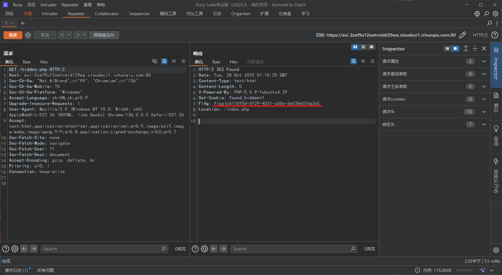
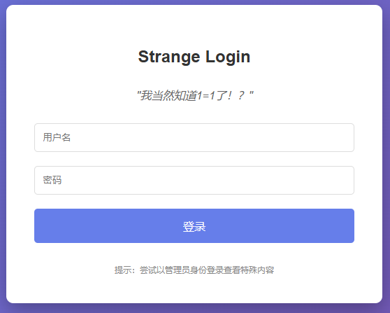
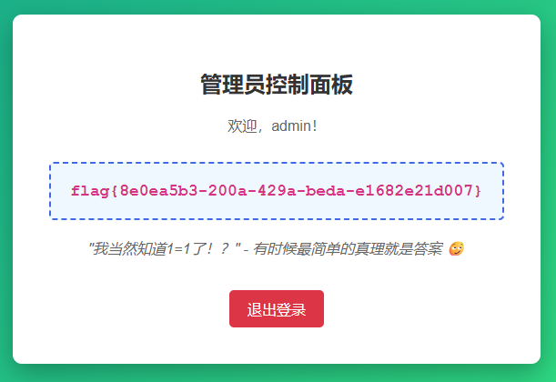
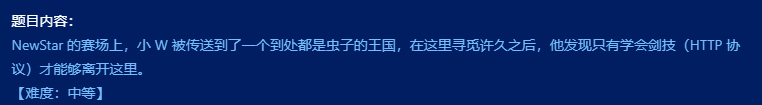
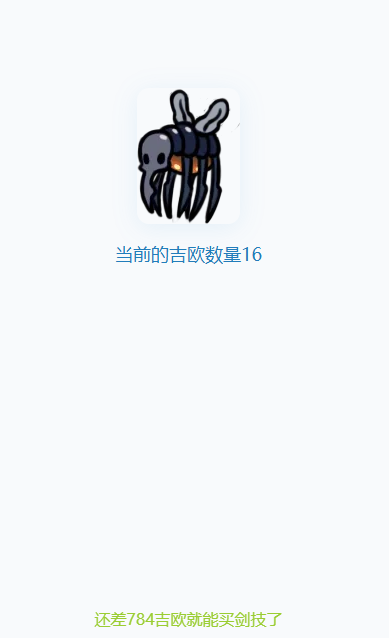
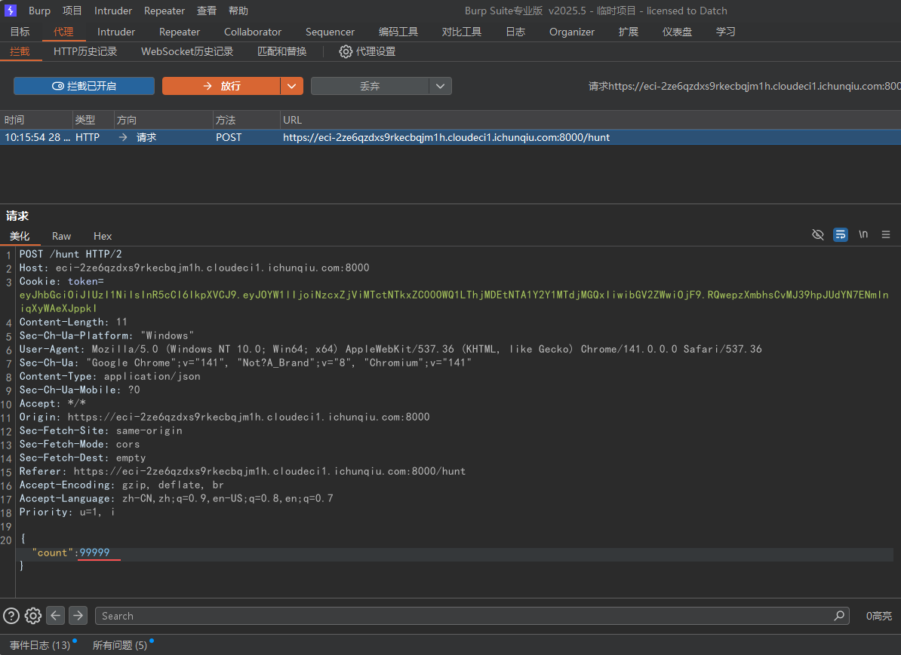
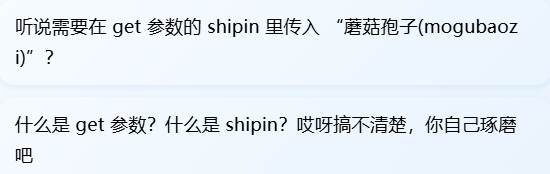
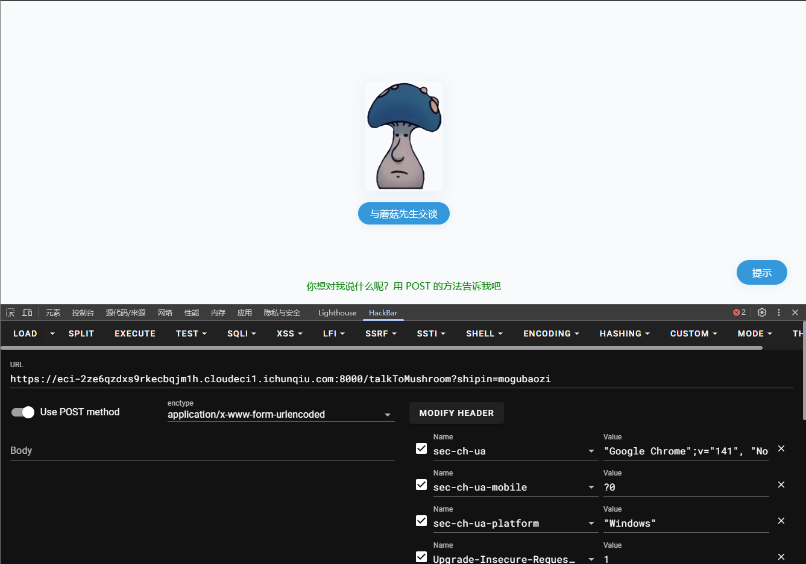
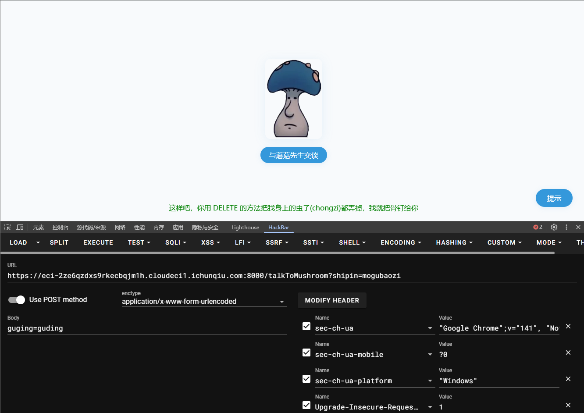
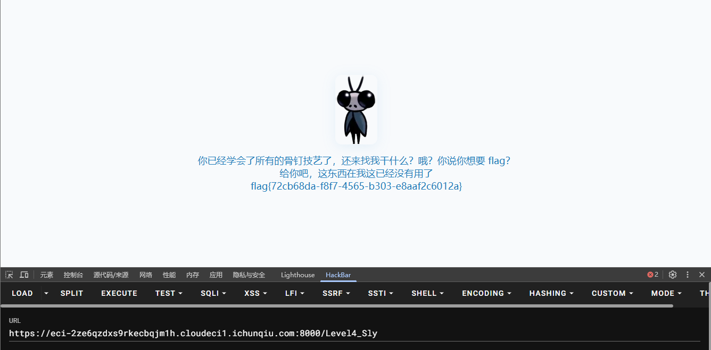

# NewStar CTF 2025 公开赛道 Web-Week1 题解
---

## 1. 题目：multi-headach3（难度：☆☆☆☆☆）
### 1.1 考点
robots.txt 协议解析、HTTP 重定向识别与抓包分析

### 1.2 题目描述


### 1.3 解题步骤
1. 访问 robots.txt 文件  
   进入题目初始页面后，在 URL 后拼接 `robots.txt`（完整路径为 `http://题目域名/robots.txt`），访问后得到配置内容：
   ```plaintext
   User-agent: *
   Disallow: /hidden.php
   ```
   该配置表明服务器禁止爬虫访问 `/hidden.php` 路径，此路径即为关键隐藏页面。

2. 分析重定向与抓包获取 flag  
   直接访问 `/hidden.php`（完整路径为 `http://题目域名/hidden.php`），会发现页面自动跳转回初始页面，无法直接查看内容。使用 Burp Suite 抓包：
   - 打开 Burp Suite，配置浏览器代理（默认端口 8080）。
   - 再次访问 `/hidden.php`，Burp 会捕获到该请求的响应包。
   
   - 在响应包的响应体或响应头中，可直接找到 flag。

---

## 2. 题目：strange_login（难度：☆☆☆☆☆）
### 2.1 考点
SQL 注入（报错注入排查、闭合符与注释符适配）

### 2.2 题目描述


### 2.3 解题步骤

1. 初步注入测试与报错分析  
   进入题目登录框，输入账号 `admin' or '1'='1'--`、任意密码（如 123），提交后出现报错：
   ```plaintext
   Query failed: SQLSTATE[42000]: Syntax error or access violation: 1064 You have an error in your SQL syntax; check the manual that corresponds to your MySQL server version for the right syntax to use near '123'' at line 1
   ```
   报错原因：注入语句中使用的 `--` 注释符未生效（可能服务器不支持该注释符），导致密码字段的引号与注入语句冲突，破坏 SQL 语法结构。

2. 更换注入语句成功登录  
   调整注入语句，使用 MySQL 支持的 `#` 注释符（需注意 URL 提交时无需转义，直接使用），账号输入：
   ```plaintext
   1' or 1=1#
   ```
   密码输入任意内容（如 123），提交后即可绕过登录验证，进入后台页面获取 flag。
   

---

## 3. 题目：黑客小 W 的故事（1）（难度：★½☆☆☆）
### 3.1 考点
HTTP 协议（JSON 响应包分析、请求方法 / 头修改、GET/POST 传参）

### 3.2 题目描述


### 3.3 解题步骤
1. 初始抓包分析进入题目页面后，直接使用 Burp Suite 抓包，准备后续改包操作。

~~叽里咕噜说什么呢~~


2. GET 传参触发有效提示页面初始提示不明确，点击 “提示” 后发现需通过 GET 传参触发下一步。




构造 GET 参数：?shipin=mogubaozi（完整路径为 http://题目域名/?shipin=mogubaozi），访问后获得清晰指引。
```plaintext
?shipin=mogubaozi
```

3. POST 传参与请求方法修改根据提示，需以 POST 方式发送参数 chongzi，同时将请求方法改为 DELETE（通过 Burp 修改请求行的请求方法）。


4. 修改 User-Agent 请求头按提示将请求头 User-Agent 改为指定内容：
```plaintext
User-Agent:CycloneSlash/2.0,DashSlash/5.0
```
5. 获取 flag
完成所有请求修改后，提交请求，页面返回 flag。



---